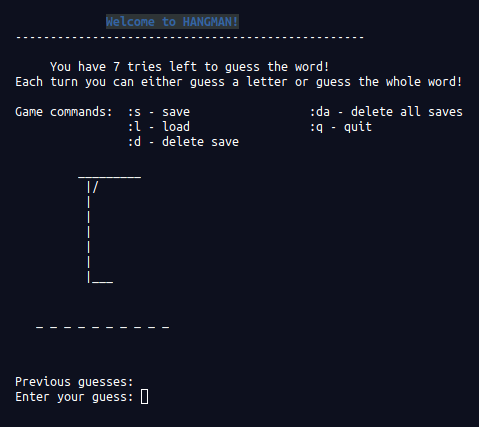

# Ruby Hangman Game!

>The Hangman Game Written for the Odin Project!

<div align='center'>
  
</div><br>

## Demo

[](https://repl.it/@andrewbaldwin44/Hangman#main.rb)

## How to Play

In Hangman, you must guess the secret word. You have seven chances before it's game over!

## Features

- Thousands of words to play
- Serialization to save or load games
- Guess a letter or try guessing the whole word!

## Dependecies

Ruby 2.6.5 (or higher)

## Run the Project

__Clone the repo to your local machine using the terminal__:
```
$ git clone git@github.com:andrewbaldwin44/Hangman.git
```

1. Navigate into the project directory `cd Ruby_Hangman_Game`
2. Run the game `ruby main.rb`

## Author

👤 **Andrew Baldwin**

- Github: [@andrewbaldwin44](https://github.com/andrewbaldwin44)
